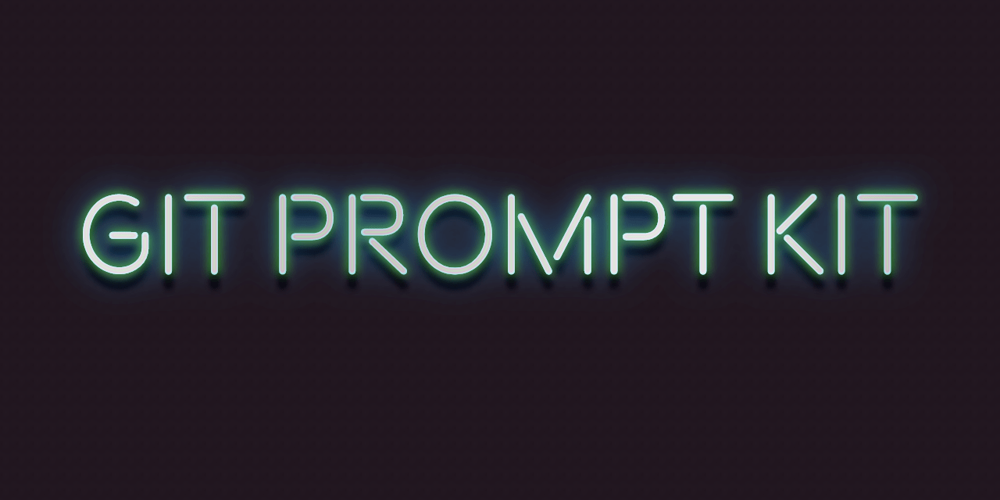

# Git Prompt Kit  

**Git Prompt Kit** is a configurable set of components for building feature rich, high performance Git-aware zsh prompts (aka themes) with minimal coding.

&nbsp;

## Documentation

📖 See the guide, including a web simulation demonstrating how the prompt responds to context and configuration, at https://git-prompt-kit.olets.dev/

&nbsp;

## Changelog

See the [CHANGELOG](CHANGELOG.md) file.

## Contributing

_Looking for the documentation site's source? See <https://github.com/olets/git-prompt-kit-docs>_

Thanks for your interest. Contributions are welcome!

> Please note that this project is released with a [Contributor Code of Conduct](CODE_OF_CONDUCT.md). By participating in this project you agree to abide by its terms.

Check the [Issues](https://github.com/olets/git-prompt-kit/issues) to see if your topic has been discussed before or if it is being worked on.

Please read [CONTRIBUTING.md](CONTRIBUTING.md) before opening a pull request.

## License

<a href="https://www.github.com/olets/git-prompt-kit">git-prompt-kit</a> by <a href="https://www.github.com/olets">Henry Bley-Vroman</a> is licensed under a license which is the unmodified text of <a href="https://creativecommons.org/licenses/by-nc-sa/4.0">CC BY-NC-SA 4.0</a> and the unmodified text of a <a href="https://firstdonoharm.dev/build?modules=eco,extr,media,mil,sv,usta">Hippocratic License 3</a>. It is not affiliated with Creative Commons or the Organization for Ethical Source.

Human-readable summary of (and not a substitute for) the [LICENSE](LICENSE) file:

You are free to

- Share — copy and redistribute the material in any medium or format
- Adapt — remix, transform, and build upon the material

Under the following terms

- Attribution — You must give appropriate credit, provide a link to the license, and indicate if changes were made. You may do so in any reasonable manner, but not in any way that suggests the licensor endorses you or your use.
- Non-commercial — You may not use the material for commercial purposes.
- Ethics - You must abide by the ethical standards specified in the Hippocratic License 3 with Ecocide, Extractive Industries, US Tariff Act, Mass Surveillance, Military Activities, and Media modules.
- Preserve terms — If you remix, transform, or build upon the material, you must distribute your contributions under the same license as the original.
- No additional restrictions — You may not apply legal terms or technological measures that legally restrict others from doing anything the license permits.

## Acknowledgments

The human-readable license summary is based on https://creativecommons.org/licenses/by-nc-sa/4.0. The ethics point was added.

Git Prompt Kit uses Roman Perepelitsa's [gitstatus](https://github.com/romkatv/gitstatus) accelerated alternative to Git's status commands.

Showing "dimmed" components was inspired by Arialdo Martini's [oh-my-git](https://github.com/arialdomartini/oh-my-git), which leaves space for inactive symbols.

The default symbol set's using `git status`'s short format was inspired by Michael Allen's [git-radar](https://github.com/michaeldfallen/git-radar).

Splash card font is Beon by [Bastien Sozeau](http://sozoo.fr/).
